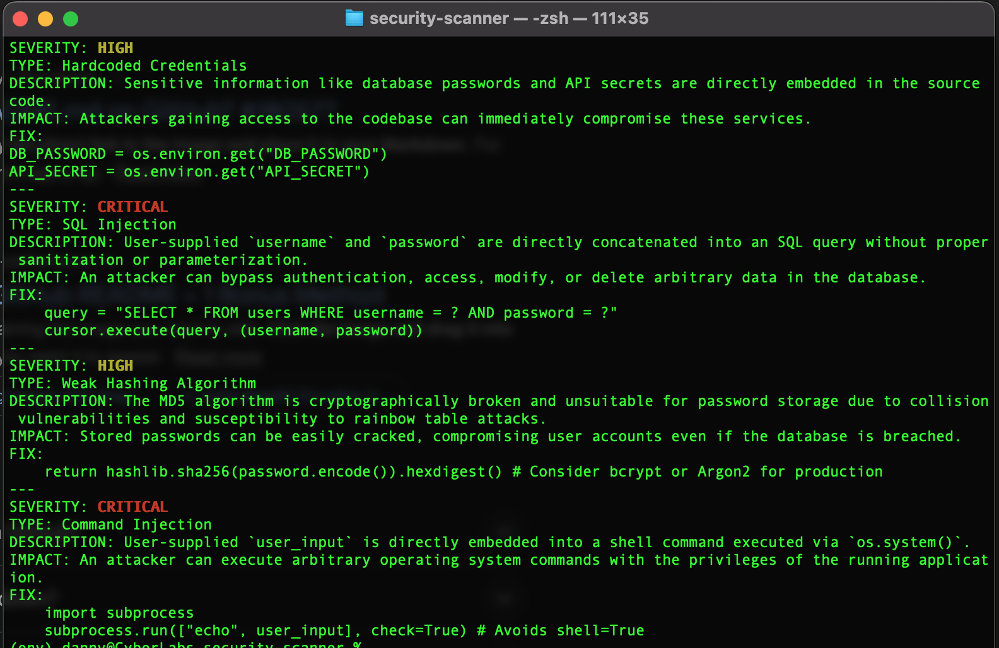

# 🛡️ AI-Powered Security Code Audit Tool

An **AI-driven static code analysis tool** built in Python that leverages **Gemini AI** to identify security vulnerabilities in Python applications. The tool performs automated security audits via a command-line interface (CLI), enabling early detection of high-impact vulnerabilities during development and security reviews.

This project is based on the NextWork AI Security Audit project and extends core AppSec concepts into an AI-assisted workflow.

---

## 🔍 Project Summary

This project demonstrates the design and implementation of an **AI-assisted application security scanner** capable of analyzing Python source code and identifying common vulnerability patterns such as:

- SQL Injection
- Hardcoded secrets and credentials
- Weak or insecure cryptographic implementations

The scanner outputs **severity-ranked findings** with clear, actionable feedback, simulating real-world **secure code review and AppSec tooling** used in modern SDLC pipelines.

---

## 🧠 Key Capabilities

- **AI-Based Static Analysis**  
  Uses a large language model to analyze source code contextually rather than relying solely on signature-based rules.

- **Vulnerability Classification**
  - SQL Injection risks
  - Hardcoded secrets (API keys, passwords, tokens)
  - Weak cryptography usage (e.g., insecure hashing)

- **Severity Assessment**
  - Critical
  - High
  - Medium
  - Low

- **Command-Line Interface (CLI)**
  - Scan individual files or entire codebases
  - Structured, color-coded output for rapid triage

- **Extensible Architecture**
  - Prompt engineering allows easy expansion to additional vulnerability classes
  - Designed to support future CI/CD integration

---

## 🛠️ Technology Stack

| Component | Description |
|---------|-------------|
| **Python** | Core application logic |
| **Gemini AI** | Context-aware vulnerability analysis |
| **argparse** | CLI argument handling |
| **colorama** | Severity-based terminal output |
| **dotenv** | Secure API key management |

---

## 📦 Setup & Installation

### Requirements

- Python 3.10+
- Gemini API key
- `pip` package manager

### Installation Steps

```bash
https://github.com/danny-seceng/security-scanner-genai-google.git
cd ai-security-scanner

python3 -m venv venv
source venv/bin/activate   # Windows: venv\Scripts\activate

pip install -r requirements.txt
```

**Rename the .env.example to .env and add your GEMINI API KEY**
GEMINI_API_KEY=your_api_key_here

## ▶️ Usage
**Run one of the files (ex:Security-Analysis-Prompt-v3.py)**
```bash
python scanner.py Security-Analysis-Prompt-v3.py vulnerable.py
```

### Output


## 🙏 Acknowledgements

**Inspired by the NextWork AI Security Audit Project**
https://learn.nextwork.org/projects/ai-security-audit
